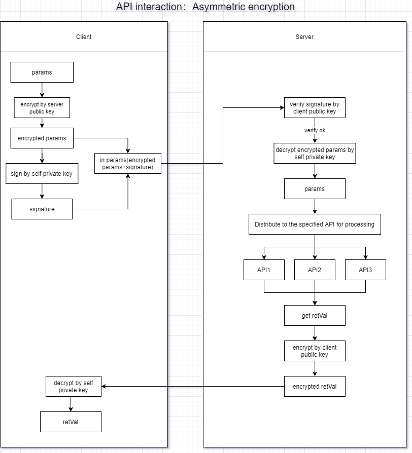
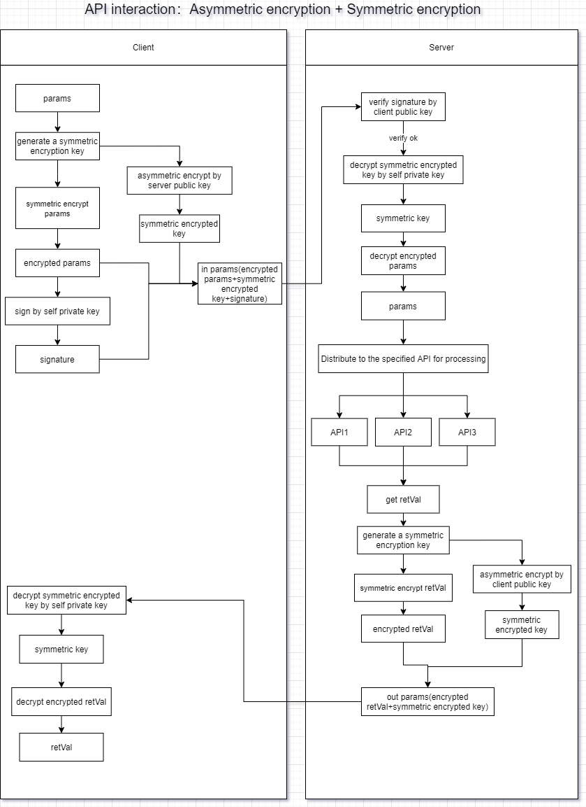
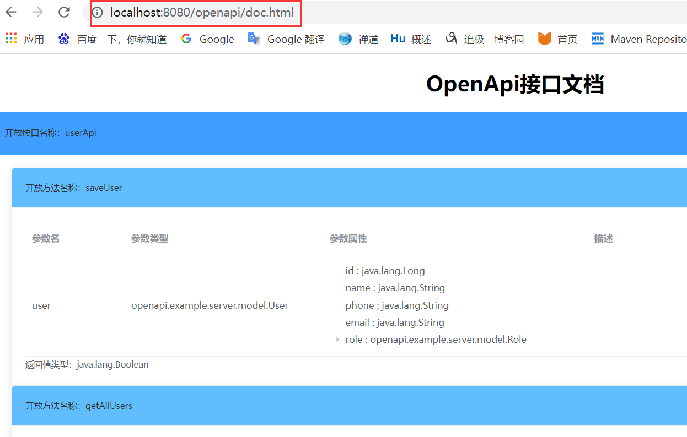
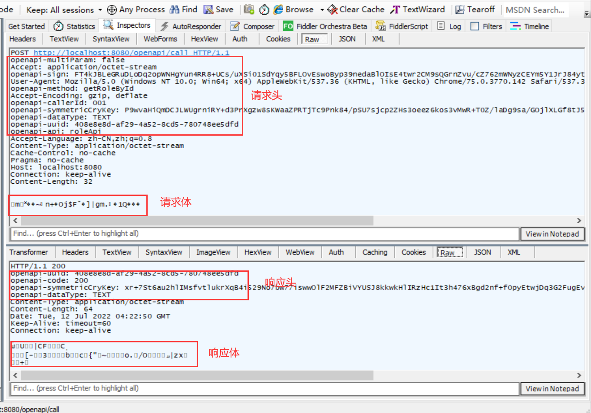

# openapi

## strive to providing an sdk that can quickly build open API

## background

For the sake of security, the interface of external services often needs to perform corresponding security processing:
data encryption transmission and identity authentication. There are two types of data encryption transmission: symmetric
encryption and asymmetric encryption. For the sake of more security, it is better to use asymmetric encryption, and
digital signature can be used for identity authentication. The purpose of developing this sdk is to quickly realize the
safe opening of the api in the project.

## frame based

spring-boot

## main dependencies

cn.hutool.hutool-all

## function

1. Responsible for opening the interface to the outside world (<font size=1>Provide services based on HTTP</font>)
2. Implement the encryption and decryption of interface parameters and return values (<font size=1>use asymmetric
   encryption: RSA/SM2, or symmetric encryption: AES/SM4</font>)
3. Implement the signature verification of the interface (<font size=1>The server will verify the client's signature to
   ensure that the caller's identity and data are not tampered with</font>)

## feature

1. Provide client sdk and server sdk to facilitate the rapid integration of open api functions in existing projects
2. Implemented three API security interaction methods: only signing + asymmetric encryption + symmetric encryption,
   configuration switching can be performed
3. Implemented a variety of encryption algorithms such as RSA and SM2 for encryption and decryption of interface
   parameters and return values
4. A set of data transmission mechanism is specially customized for file transfer, making file transfer more convenient
   and fast
5. Implemented the server interface document function, which is convenient for querying all API interfaces
6. Method invocation implements HTTP timeout, HTTP proxy and other settings, and supports method-level configuration

## program flow chart

   
   

## Instructions

### Server

#### 1.import openapi-server-sdk

```xml

<dependency>
    <groupId>io.github.hdwang123</groupId>
    <artifactId>openapi-server-sdk</artifactId>
    <version>1.5.7</version>
</dependency>
```

#### 2.implement interface OpenApiConfig to config

<font size=1 color=#ff6600>
Note: There is no configuration implementation class by default, an error will be reported when starting the project, and an OpenApiConfig implementation class must be manually configured.
</font>

```java

@Component
public class OpenApiConfigImpl implements OpenApiConfig {

    @Value("${keys.local.rsa.privateKey}")
    private String privateKey;

    @Value("${keys.remote.rsa.publicKey}")
    private String callerPublicKey;

    @Override
    public AsymmetricCryEnum getAsymmetricCry() {
        //设置非对称加密算法
        return AsymmetricCryEnum.RSA;
    }

    @Override
    public String getCallerPublicKey(String callerId) {
        //TODO 根据调用者ID查找调用者的公钥（可以将所有调用者的公钥存到数据库中）
        return callerPublicKey;
    }

    @Override
    public String getSelfPrivateKey() {
        //设置服务端私钥
        return privateKey;
    }

    @Override
    public boolean retEncrypt() {
        //设置返回值是否需要加密
        return true;
    }

    @Override
    public CryModeEnum getCryMode() {
        //设置加密模式
        return CryModeEnum.SYMMETRIC_CRY;
    }

    @Override
    public SymmetricCryEnum getSymmetricCry() {
        //设置对称加密算法
        return SymmetricCryEnum.AES;
    }

    @Override
    public boolean enableDoc() {
        //是否启用接口文档功能
        return true;
    }
}
```

#### 3.Custom open API

<font size=1  color=#ff6600>
Note: The class identified by @OpenApi must be in the scan path of the spring package before it can be injected into the container.
</font>

```java

@Slf4j
@OpenApi("userApi")
public class UserApi {

    @OpenApiMethod("getUserById")
    public User getUserById(Long id) {
        log.info("getUserById：id=" + id);
        User user = new User();
        user.setId(1L);
        user.setName("bob");
        return user;
    }
}
```

#### 4.see openapi doc

url：http://localhost:8080/openapi/doc.html  
Replace http://localhost:8080 with the actual path in the actual project   


### Client

#### 1.import openapi-client-sdk

```xml

<dependency>
    <groupId>io.github.hdwang123</groupId>
    <artifactId>openapi-client-sdk</artifactId>
    <version>1.5.7</version>
</dependency>
```

#### 2.call openapi

##### method one

Call OpenApiClient directly

```java

@Slf4j
@Component
public class UserApiClient {

    @Value("${keys.local.rsa.privateKey}")
    private String privateKey;

    @Value("${keys.remote.rsa.publicKey}")
    private String remotePublicKey;

    String baseUrl = "http://localhost:8080";

    /**
     * 定义OpenApiClient
     */
    OpenApiClient apiClient = null;

    @PostConstruct
    public void init() {
        apiClient = new OpenApiClientBuilder(baseUrl, privateKey, remotePublicKey, "001", "userApi")
                .asymmetricCry(AsymmetricCryEnum.RSA)
                .retDecrypt(true)
                .cryModeEnum(CryModeEnum.SYMMETRIC_CRY)
                .symmetricCry(SymmetricCryEnum.AES)
                .build();
    }


    public void getUserById() {
        OutParams outParams = apiClient.callOpenApi("getUserById", 10001);
        log.info("返回值：" + outParams);
    }
}
```

##### method two

Use the annotation @OpenApiRef to define a service reference and inject it where needed

1. Define the configuration

```yaml
openapi:
  client:
    config:
      openApiRefPath: openapi.example.client.openapiclient
      baseUrl: http://localhost:8080
      selfPrivateKey: ${keys.local.rsa.privateKey}
      remotePublicKey: ${keys.remote.rsa.publicKey}
      asymmetricCryEnum: RSA
      retDecrypt: true
      cryModeEnum: SYMMETRIC_CRY
      symmetricCryEnum: AES
      callerId: "001"
      httpConnectionTimeout: 3
      httpReadTimeout: 6
#      httpProxyHost: 127.0.0.1
#      httpProxyPort: 8888
```

2. Define the service reference

```java

@OpenApiRef(value = "userApi")
public interface UserApiClient {

    @OpenApiMethod("getUserById")
    User getUserById(Long id);
}
```

3. Inject the service reference to call the remote openapi service

```java

@Component
public class UserApiTest2 {

    @Autowired
    UserApiClient userApiClient;

    public void getUserById() {
        User user = userApiClient.getUserById(10001L);
        log.info("ret：" + user);
    }
}    
```

#### 3.http call sample

